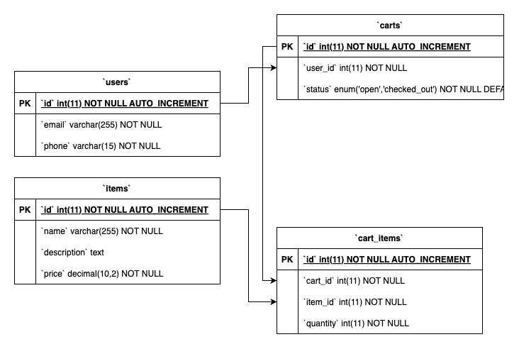

# Online Shop

This is a simple online shop built with PHP using the CodeIgniter 4 framework and MySQL.

## Requirements

- PHP 7.3 or higher
- MySQL 5.7 or higher
- Composer

## Installation

1. Clone this repository to your local machine.
2. Navigate to the project directory.
3. Run `composer install` to install the required dependencies.
4. Copy `env` to `.env` and tailor for your app, specifically the baseURL and any database settings.

## Database Setup

This project uses CodeIgniter's migration feature to set up the database.

1. Open the `.env` file and update the database settings. If you're using MacOS, the hostname should be `database.default.hostname = 127.0.0.1`. If you're using Windows, you can use `localhost`.
2. Run `php spark migrate` to perform the migrations and set up the database.

## Endpoints

| Endpoint | HTTP Method | Description |
|----------|-------------|-------------|
| `/register` | POST | Register a new user |
| `/item/create` | POST | Add a new item |
| `/item/update/{id}` | PUT | Update an existing item |
| `/cart/create` | POST | Create a new cart |
| `/cart/checkout/{id}` | PUT | Checkout a cart |
| `/cart/history/{id}` | GET | Get a user's shopping history |
| `/cartitem/create` | POST | Add an item to a cart |

## Running the Application

To start the application, navigate to the project directory and run `php spark serve`. Then, open your web browser and navigate to `http://localhost:8080`.

## Contributing

Pull requests are welcome. For major changes, please open an issue first to discuss what you would like to change.